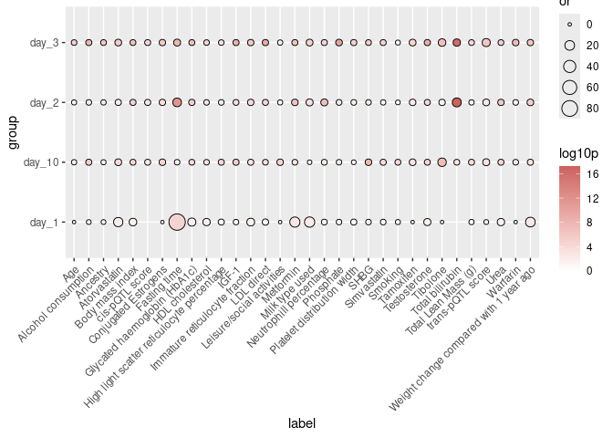

<!-- README.md is generated from README.Rmd. Please edit that file -->

# `prodente`: **Pro**tein **De**terminants **En**richment **Tes**ting

<!-- badges: start -->
<!-- badges: end -->

The goal of `prodente` is to make results from an upcoming publication
immediately accessible and useful. This package contains functions to
easily test a list of proteins for enrichment of UK Biobank study
characteristics.

## Installation

You can install the development version of `prodente` directly from
GitHub:

``` r
library(remotes)
install_github("comp-med/prodente")
```

## Getting Started

The API consists only of a hand-full of functions that mostly make
working with the results table more convenient. Each important results
object is immediately available as accessible data.

``` r
library(prodente)

# There is example data provided
fasting_study_results <- prodente::fasting_study_results

# It is important to check that protein identifiers of your data are available
# in the background data.
check_protein_overlap(fasting_study_results$protein_id, return_missing = TRUE)
#> character(0)


# Make sure to check the provided mapping table in case you have missing
# proteins. Maybe they are in the data but formatted slightly differently.
# Additionally, the table provides Olink IDs and UniProt IDs to make matching 
# easier
head(prodente::protein_mapping_table)
#>    mapping_id           panel olink_id    assay uniprot hgnc_symbol
#>        <char>          <char>   <char>   <char>  <char>      <char>
#> 1:   adamts13 Cardiometabolic OID20249 ADAMTS13  Q76LX8    ADAMTS13
#> 2:      alcam Cardiometabolic OID20273    ALCAM  Q13740       ALCAM
#> 3:       blmh Cardiometabolic OID20336     BLMH  Q13867        BLMH
#> 4:        ca4 Cardiometabolic OID20241      CA4  P22748         CA4
#> 5:      casp3 Cardiometabolic OID20305    CASP3  P42574       CASP3
#> 6:      ccl15 Cardiometabolic OID20328    CCL15  Q16663       CCL15
```

Enrichment tests can be stratified by sex or genetic ancestry. Set the
`test_across` parameter of the function
`enrich_protein_characteristics()` to do so.

``` r
# Run enrichment tests for a list of proteins
results <- enrich_protein_characteristics(
  protein_foreground = fasting_study_results[group == "day_1", protein_id], 
  factor_minimum_explained_variance = 0, 
  test_across = "sex",
  n_cores = 8
  )


head(results[pval < 0.05 & or > 5, .(population, label)])
#>    population        label
#>        <char>       <char>
#> 1:        All      Insulin
#> 2:        All    Metformin
#> 3:     Female    Metformin
#> 4:       Male    Metformin
#> 5:       Male Bread intake
#> 6:        All Atorvastatin
```

Enrichment tests can also be performed across several groups. Use the
function `enrichment_test_across_groups()` for this.

``` r
# When data for several groups is available, supply a names list to this function
group_data <- list(
  day_1 = fasting_study_results[group == "day_1", protein_id],
  day_2 = fasting_study_results[group == "day_2", protein_id],
  day_3 = fasting_study_results[group == "day_3", protein_id],
  day_10 = fasting_study_results[group == "day_10", protein_id]
)

group_results <- enrichment_test_across_groups(
  protein_foreground_list = group_data, 
  test_across = "sex", 
  n_cores = 8
)

# You can plot enrichment results for a single subgroup (within either `sex` or `ancestry`)
enrichment_plot <- plot_enrichment_results(
  group_results,
  plot_population = "All"
)
```


